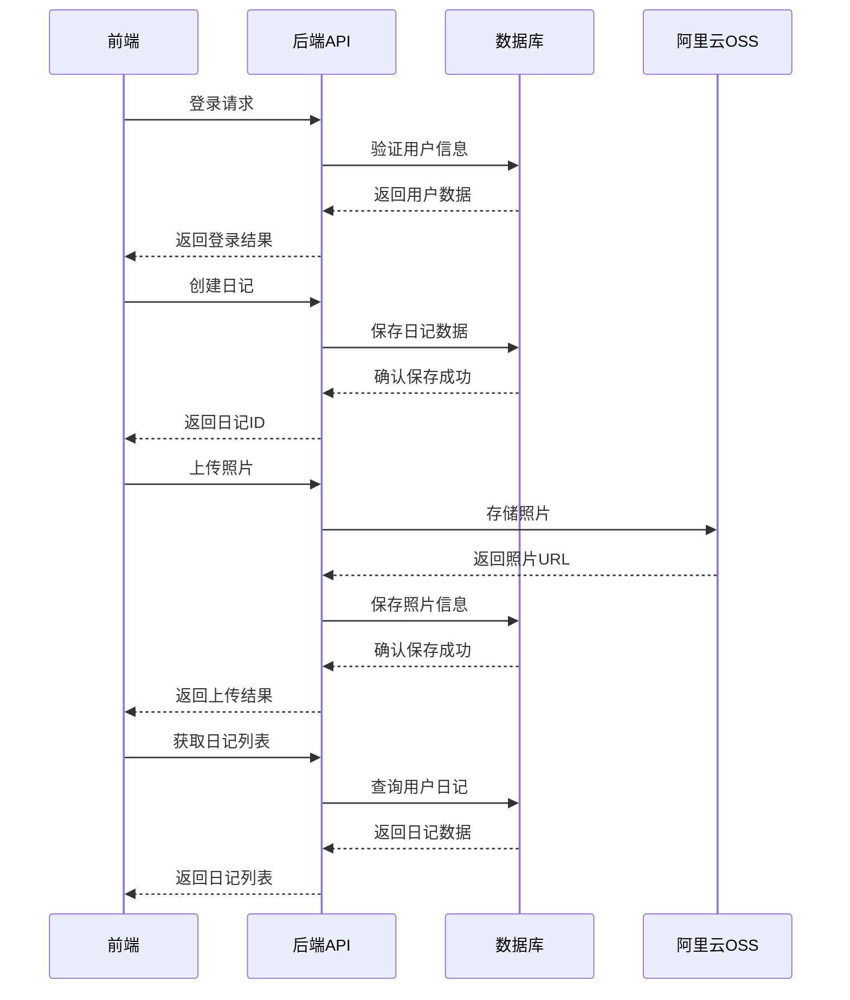
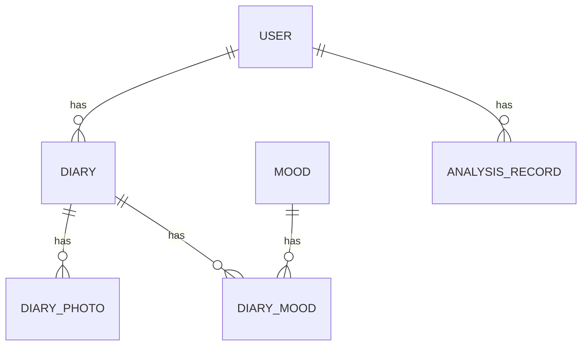

# 基于多模态+ai agent的心影日记项目开发文档

## 1. 项目概述

### 1.1 项目简介
心影日记是一个专注于记录生活点滴和分享美好回忆的平台。用户可以通过该平台记录每日心情、上传照片、分享生活感悟，并与AI助手进行智能聊天。

### 1.2 核心功能
- 日记记录与管理（创建、编辑、删除、查看）
- 照片上传与管理（支持阿里云OSS存储）
- 心情记录与统计
- 智能聊天（基于火山引擎API）
- 绘梦功能（根据心情生成卡通风格图像）
- 个人主页与数据统计
- 系统设置（主题、字体、通知等）

### 1.3 目标用户
- 希望记录生活点滴的个人用户
- 喜欢分享生活感悟的社交用户
- 寻求情感支持和智能互动的用户

## 2. 技术架构

### 2.1 前端技术栈
- **框架**：React 18
- **构建工具**：Vite
- **状态管理**：LocalStorage（轻量级状态管理）
- **UI组件库**：Ant Design
- **动画库**：Framer Motion
- **路由**：React Router v6
- **HTTP客户端**：Fetch API

### 2.2 后端技术栈
- **框架**：Spring Boot 3.0+
- **ORM**：MyBatis
- **数据库**：MySQL
- **存储**：阿里云OSS
- **安全**：Spring Security
- **密码加密**：BCrypt

### 2.3 系统架构



## 3. 前端实现

### 3.1 项目结构

```
src/
├── assets/           # 静态资源
│   └── logo.png      # 项目Logo
├── components/       # 公共组件
│   ├── Header.jsx    # 头部组件
│   ├── Sidebar.jsx   # 侧边栏组件
│   └── AnalysisResult.jsx  # 分析结果组件
├── pages/            # 页面组件
│   ├── AskPage.jsx           # 智能聊天页面
│   ├── CreateDiaryPage.jsx   # 创建日记页面
│   ├── DiaryPage.jsx         # 日记列表页面
│   ├── DreamPage.jsx         # 绘梦页面
│   ├── GamePage.jsx          # 游戏页面
│   ├── LoginPage.jsx         # 登录页面
│   ├── ProfilePage.jsx       # 个人主页
│   ├── SettingsPage.jsx      # 系统设置页面
│   └── SharePage.jsx         # 分享页面
├── styles/           # 样式文件
│   ├── App.css       # 全局样式
│   ├── AskPage.css   # 智能聊天页面样式
│   ├── CreateDiaryPage.css   # 创建日记页面样式
│   ├── DiaryPage.css         # 日记列表页面样式
│   ├── DreamPage.css         # 绘梦页面样式
│   ├── GamePage.css          # 游戏页面样式
│   ├── LoginPage.css         # 登录页面样式
│   ├── ProfilePage.css       # 个人主页样式
│   ├── SettingsPage.css      # 系统设置页面样式
│   └── SharePage.css         # 分享页面样式
├── theme/            # 主题配置
│   └── antdTheme.js  # Ant Design主题配置
├── utils/            # 工具函数
│   ├── api.js        # API请求工具
│   ├── diaryData.js  # 日记数据处理
│   └── doubaoApi.js  # 豆包API请求工具
├── App.jsx           # 应用入口
└── main.jsx          # 渲染入口
```

### 3.2 核心页面实现

#### 3.2.1 登录页面
- **功能**：用户登录和注册
- **实现**：使用表单验证，调用后端认证API
- **关键代码**：
  - 登录逻辑：`LoginPage.jsx` 中的 `handleLogin` 函数
  - 注册逻辑：`LoginPage.jsx` 中的 `handleRegister` 函数

#### 3.2.2 日记列表页面
- **功能**：展示用户的所有日记，支持查看、编辑、删除操作
- **实现**：从后端API获取日记数据，支持分页和搜索
- **关键代码**：
  - 获取日记列表：`DiaryPage.jsx` 中的 `fetchDiaries` 函数
  - 编辑日记：`DiaryPage.jsx` 中的 `editDiary` 函数
  - 删除日记：`DiaryPage.jsx` 中的 `deleteDiary` 函数

#### 3.2.3 创建日记页面
- **功能**：创建新日记，支持添加照片和选择心情
- **实现**：使用表单提交，调用后端API创建日记
- **关键代码**：
  - 保存日记：`CreateDiaryPage.jsx` 中的 `saveDiary` 函数
  - 上传图片：`CreateDiaryPage.jsx` 中的 `uploadImage` 函数

#### 3.2.4 个人主页
- **功能**：展示用户信息和日记统计数据
- **实现**：从后端API获取用户数据和日记统计
- **关键代码**：
  - 获取用户信息：`ProfilePage.jsx` 中的 `useEffect` 钩子
  - 计算心情统计：`ProfilePage.jsx` 中的 `calculateMoodStats` 函数

#### 3.2.5 智能聊天页面
- **功能**：与AI助手进行智能聊天
- **实现**：调用豆包API获取AI回复
- **关键代码**：
  - 发送消息：`AskPage.jsx` 中的 `sendMessage` 函数
  - 获取AI回复：`AskPage.jsx` 中的 `getAIAnswer` 函数

#### 3.2.6 绘梦页面
- **功能**：上传照片，根据心情生成卡通风格图像
- **实现**：调用后端API进行图像生成
- **关键代码**：
  - 生成图像：`DreamPage.jsx` 中的 `generateDream` 函数
  - 保存历史记录：`DreamPage.jsx` 中的 `saveToHistory` 函数

#### 3.2.7 系统设置页面
- **功能**：自定义用户体验，包括主题、字体、通知等设置
- **实现**：使用LocalStorage保存用户设置
- **关键代码**：
  - 主题设置：`SettingsPage.jsx` 中的 `setCurrentTheme` 函数
  - 字体设置：`SettingsPage.jsx` 中的 `setCurrentFontSize` 函数
  - 个人信息更新：`SettingsPage.jsx` 中的 `updateUserInfo` 函数

### 3.3 前端API调用

前端通过 `utils/api.js` 文件中的API工具函数与后端进行交互，主要包括：

- **认证API**：登录、注册、获取用户信息
- **日记API**：创建、获取、更新、删除日记
- **照片API**：上传、获取、删除照片
- **分析API**：人脸分析相关操作
- **豆包API**：智能聊天相关操作

## 4. 后端实现

### 4.1 项目结构

```
Light_Heart_Diary_01/
src/main/java/com/lhy/face_recognition/
├── config/           # 配置类
│   ├── CorsConfig.java      # CORS配置
│   ├── OssConfig.java       # OSS配置
│   ├── RestTemplateConfig.java  # RestTemplate配置
│   └── SecurityConfig.java  # 安全配置
├── controller/       # 控制器
│   ├── AnalysisController.java  # 分析控制器
│   ├── AuthController.java      # 认证控制器
│   ├── DiaryController.java     # 日记控制器
│   ├── DoubaoController.java    # 豆包控制器
│   └── OssController.java       # OSS控制器
├── entity/           # 实体类
│   ├── AnalysisRecord.java  # 分析记录
│   ├── Diary.java           # 日记
│   ├── DiaryMood.java       # 日记心情
│   ├── DiaryPhoto.java      # 日记照片
│   ├── Mood.java            # 心情
│   └── User.java            # 用户
├── mapper/           # MyBatis映射接口
│   ├── AnalysisRecordMapper.java  # 分析记录映射
│   ├── DiaryMapper.java           # 日记映射
│   ├── DiaryMoodMapper.java       # 日记心情映射
│   ├── DiaryPhotoMapper.java      # 日记照片映射
│   ├── MoodMapper.java            # 心情映射
│   └── UserMapper.java            # 用户映射
├── service/          # 服务接口
│   ├── impl/         # 服务实现
│   │   ├── AnalysisRecordServiceImpl.java  # 分析记录服务实现
│   │   ├── DiaryServiceImpl.java           # 日记服务实现
│   │   ├── DoubaoServiceImpl.java          # 豆包服务实现
│   │   ├── MoodServiceImpl.java            # 心情服务实现
│   │   ├── OssServiceImpl.java             # OSS服务实现
│   │   └── UserServiceImpl.java            # 用户服务实现
│   ├── AnalysisRecordService.java  # 分析记录服务
│   ├── DiaryService.java           # 日记服务
│   ├── DoubaoService.java          # 豆包服务
│   ├── ExpressionRecognitionService.java  # 表情识别服务
│   ├── MoodService.java            # 心情服务
│   ├── OssService.java             # OSS服务
│   └── UserService.java            # 用户服务
└── FaceRecognitionApplication.java  # 应用入口
```

### 4.2 核心功能实现

#### 4.2.1 用户认证
- **功能**：用户登录、注册、获取用户信息
- **实现**：使用Spring Security进行认证，BCrypt进行密码加密
- **关键代码**：
  - 登录：`AuthController.java` 中的 `login` 方法
  - 注册：`AuthController.java` 中的 `register` 方法
  - 密码加密：`UserServiceImpl.java` 中的 `register` 方法

#### 4.2.2 日记管理
- **功能**：创建、获取、更新、删除日记
- **实现**：使用MyBatis进行数据库操作，确保用户只能访问自己的日记
- **关键代码**：
  - 创建日记：`DiaryServiceImpl.java` 中的 `createDiary` 方法
  - 获取日记：`DiaryServiceImpl.java` 中的 `getDiaryById` 方法
  - 更新日记：`DiaryServiceImpl.java` 中的 `updateDiary` 方法
  - 删除日记：`DiaryServiceImpl.java` 中的 `deleteDiary` 方法

#### 4.2.3 照片管理
- **功能**：上传、获取、删除照片
- **实现**：使用阿里云OSS存储照片，数据库存储照片URL
- **关键代码**：
  - 上传照片：`OssServiceImpl.java` 中的 `uploadFile` 方法
  - 添加照片：`DiaryServiceImpl.java` 中的 `addDiaryPhoto` 方法
  - 获取照片：`DiaryServiceImpl.java` 中的 `getPhotosByDiaryId` 方法

#### 4.2.4 心情管理
- **功能**：管理日记的心情标签
- **实现**：使用数据库存储心情数据和日记-心情关联
- **关键代码**：
  - 获取所有心情：`MoodServiceImpl.java` 中的 `getAllMoods` 方法
  - 添加日记心情：`DiaryServiceImpl.java` 中的 `addDiaryMood` 方法

#### 4.2.5 智能聊天
- **功能**：与AI助手进行智能聊天
- **实现**：调用豆包API获取AI回复
- **关键代码**：
  - 发送消息：`DoubaoServiceImpl.java` 中的 `sendMessage` 方法

#### 4.2.6 绘梦功能
- **功能**：根据照片和心情生成卡通风格图像
- **实现**：调用豆包API进行图像生成
- **关键代码**：
  - 生成图像：`DoubaoServiceImpl.java` 中的 `generateImage` 方法

### 4.3 后端API接口

#### 4.3.1 认证API
- `POST /api/auth/login`：用户登录
- `POST /api/auth/register`：用户注册
- `GET /api/auth/user/{id}`：获取用户信息

#### 4.3.2 日记API
- `GET /api/diary/moods`：获取所有心情
- `POST /api/diary`：创建日记
- `GET /api/diary/user/{userId}`：根据用户ID获取所有日记
- `GET /api/diary/{id}/{userId}`：根据ID获取日记
- `GET /api/diary/user/{userId}/date-range`：根据用户ID和日期范围获取日记
- `PUT /api/diary/{id}`：更新日记
- `DELETE /api/diary/{id}/{userId}`：删除日记
- `POST /api/diary/{id}/photos`：为日记添加照片
- `GET /api/diary/{id}/photos`：根据日记ID获取照片列表
- `DELETE /api/diary/photos/{photoId}`：删除照片
- `POST /api/diary/{id}/moods`：为日记添加心情
- `GET /api/diary/{id}/moods`：根据日记ID获取心情列表
- `DELETE /api/diary/{id}/moods`：删除日记的所有心情关联

#### 4.3.3 分析API
- `GET /api/analysis/records`：获取所有分析记录
- `GET /api/analysis/records/latest`：获取最新的分析记录
- `GET /api/analysis/records/{id}`：根据ID获取分析记录
- `GET /api/analysis/records/date-range`：根据日期范围获取分析记录
- `GET /api/analysis/records/dominant-expression/{expression}`：根据主要表情获取分析记录
- `POST /api/analysis/analyze`：上传图片进行分析
- `DELETE /api/analysis/records/{id}`：删除分析记录
- `PUT /api/analysis/records/{id}/emotions`：更新分析记录的表情数据

#### 4.3.4 豆包API
- `POST /api/doubao/message`：发送消息到豆包API
- `POST /api/doubao/image`：生成图像

#### 4.3.5 OSS API
- `POST /api/oss/upload`：上传文件到OSS

## 5. 数据库设计

### 5.1 数据库表结构

#### 5.1.1 用户表（user）
| 字段名 | 数据类型 | 约束 | 描述 |
| :--- | :--- | :--- | :--- |
| `id` | `BIGINT` | `PRIMARY KEY, AUTO_INCREMENT` | 用户ID |
| `username` | `VARCHAR(50)` | `UNIQUE, NOT NULL` | 用户名 |
| `password` | `VARCHAR(255)` | `NOT NULL` | 密码（加密存储） |
| `avatar` | `VARCHAR(255)` | | 头像URL |
| `bio` | `TEXT` | | 个人简介 |
| `followers` | `INT` | `DEFAULT 0` | 粉丝数 |
| `following` | `INT` | `DEFAULT 0` | 关注数 |
| `likes` | `INT` | `DEFAULT 0` | 获赞数 |
| `created_at` | `DATETIME` | `DEFAULT CURRENT_TIMESTAMP` | 创建时间 |
| `updated_at` | `DATETIME` | `DEFAULT CURRENT_TIMESTAMP ON UPDATE CURRENT_TIMESTAMP` | 更新时间 |

#### 5.1.2 日记表（diary）
| 字段名 | 数据类型 | 约束 | 描述 |
| :--- | :--- | :--- | :--- |
| `id` | `BIGINT` | `PRIMARY KEY, AUTO_INCREMENT` | 日记ID |
| `user_id` | `BIGINT` | `NOT NULL, FOREIGN KEY` | 用户ID |
| `title` | `VARCHAR(100)` | `NOT NULL` | 标题 |
| `content` | `TEXT` | `NOT NULL` | 内容 |
| `diary_date` | `DATE` | `NOT NULL` | 日记日期 |
| `selected_mood` | `VARCHAR(20)` | | 选择的心情 |
| `created_at` | `DATETIME` | `DEFAULT CURRENT_TIMESTAMP` | 创建时间 |
| `updated_at` | `DATETIME` | `DEFAULT CURRENT_TIMESTAMP ON UPDATE CURRENT_TIMESTAMP` | 更新时间 |

#### 5.1.3 日记照片表（diary_photo）
| 字段名 | 数据类型 | 约束 | 描述 |
| :--- | :--- | :--- | :--- |
| `id` | `BIGINT` | `PRIMARY KEY, AUTO_INCREMENT` | 照片ID |
| `diary_id` | `BIGINT` | `NOT NULL, FOREIGN KEY` | 日记ID |
| `photo_url` | `VARCHAR(255)` | `NOT NULL` | 照片URL |
| `created_at` | `DATETIME` | `DEFAULT CURRENT_TIMESTAMP` | 创建时间 |

#### 5.1.4 心情表（mood）
| 字段名 | 数据类型 | 约束 | 描述 |
| :--- | :--- | :--- | :--- |
| `id` | `BIGINT` | `PRIMARY KEY, AUTO_INCREMENT` | 心情ID |
| `name` | `VARCHAR(20)` | `NOT NULL, UNIQUE` | 心情名称 |
| `created_at` | `DATETIME` | `DEFAULT CURRENT_TIMESTAMP` | 创建时间 |

#### 5.1.5 日记心情表（diary_mood）
| 字段名 | 数据类型 | 约束 | 描述 |
| :--- | :--- | :--- | :--- |
| `id` | `BIGINT` | `PRIMARY KEY, AUTO_INCREMENT` | ID |
| `diary_id` | `BIGINT` | `NOT NULL, FOREIGN KEY` | 日记ID |
| `mood_id` | `BIGINT` | `NOT NULL, FOREIGN KEY` | 心情ID |
| `created_at` | `DATETIME` | `DEFAULT CURRENT_TIMESTAMP` | 创建时间 |

#### 5.1.6 分析记录表（analysis_record）
| 字段名 | 数据类型 | 约束 | 描述 |
| :--- | :--- | :--- | :--- |
| `id` | `BIGINT` | `PRIMARY KEY, AUTO_INCREMENT` | 记录ID |
| `user_id` | `BIGINT` | `FOREIGN KEY` | 用户ID |
| `image_url` | `VARCHAR(255)` | `NOT NULL` | 图像URL |
| `dominant_expression` | `VARCHAR(20)` | | 主要表情 |
| `emotion_data` | `JSON` | | 表情数据 |
| `created_at` | `DATETIME` | `DEFAULT CURRENT_TIMESTAMP` | 创建时间 |

### 5.2 数据库关系图



## 6. 部署与运行

### 6.1 前端部署

1. **安装依赖**：
   ```bash
   npm install
   ```

2. **开发环境运行**：
   ```bash
   npm run dev
   ```

3. **生产环境构建**：
   ```bash
   npm run build
   ```

4. **部署到服务器**：
   将 `dist` 目录下的文件部署到Web服务器（如Nginx、Apache等）

### 6.2 后端部署

1. **配置数据库**：
   - 创建MySQL数据库
   - 执行 `src/main/resources/sql/create_complete_schema.sql` 初始化数据库表结构

2. **配置阿里云OSS**：
   - 在 `application.yml` 中配置OSS相关参数

3. **构建项目**：
   ```bash
   mvn clean package
   ```

4. **运行项目**：
   ```bash
   java -jar target/face_recognition-0.0.1-SNAPSHOT.jar
   ```

5. **部署到服务器**：
   - 将构建好的jar包部署到服务器
   - 使用systemd或其他服务管理工具管理服务

### 6.3 环境配置

#### 6.3.1 前端环境变量
- `VITE_API_BASE_URL`：后端API基础URL

#### 6.3.2 后端环境变量
- `spring.datasource.url`：数据库连接URL
- `spring.datasource.username`：数据库用户名
- `spring.datasource.password`：数据库密码
- `aliyun.oss.endpoint`：阿里云OSS端点
- `aliyun.oss.bucket-name`：阿里云OSS存储桶名称
- `aliyun.oss.access-key-id`：阿里云OSS访问密钥ID
- `aliyun.oss.access-key-secret`：阿里云OSS访问密钥Secret

## 7. 项目亮点与创新

### 7.1 技术亮点
- **前后端分离架构**：使用React和Spring Boot构建前后端分离应用，提高开发效率和系统可维护性
- **阿里云OSS存储**：使用阿里云OSS存储照片，提高存储可靠性和访问速度
- **智能AI交互**：集成豆包API实现智能聊天和图像生成功能
- **响应式设计**：适配不同屏幕尺寸，提供良好的用户体验
- **模块化开发**：采用模块化设计，代码结构清晰，易于维护和扩展

### 7.2 功能创新
- **心情记录与统计**：通过心情标签和统计图表，帮助用户了解自己的情绪变化
- **绘梦功能**：根据照片和心情生成卡通风格图像，增加平台的趣味性和互动性
- **智能聊天**：与AI助手进行智能聊天，提供情感支持和生活建议
- **个人主页数据可视化**：通过图表展示用户的日记统计数据，帮助用户了解自己的生活状态
- **系统设置个性化**：支持主题、字体、通知等个性化设置，提高用户体验

## 8. 未来规划

### 8.1 功能扩展
- **社交功能**：增加关注、点赞、评论等社交功能，增强用户互动
- **日记分类**：支持日记分类和标签管理，方便用户整理和查找日记
- **数据备份**：支持日记数据的导出和备份，保障用户数据安全
- **多端同步**：支持多设备数据同步，方便用户随时随地访问日记
- **语音日记**：支持语音输入和语音转文字功能，提高日记记录的便捷性

### 8.2 技术优化
- **性能优化**：优化前端渲染性能和后端API响应速度
- **安全性增强**：加强用户认证和授权，提高系统安全性
- **代码重构**：优化代码结构和逻辑，提高代码质量和可维护性
- **测试覆盖**：增加单元测试和集成测试，提高系统稳定性
- **CI/CD**：配置持续集成和持续部署，提高开发效率

## 9. 总结

心影日记是一个功能完整、技术先进的个人日记平台，它不仅提供了传统的日记记录功能，还集成了智能AI交互、图像生成等创新功能，为用户提供了一个全方位的生活记录和分享平台。

通过本项目的开发，我们展示了如何使用现代前端和后端技术构建一个完整的Web应用，包括用户认证、数据存储、API设计、前端交互等多个方面。项目的模块化设计和清晰的代码结构，为后续的功能扩展和维护奠定了良好的基础。

未来，我们将继续优化和扩展心影日记的功能，为用户提供更加丰富和个性化的服务，使其成为用户记录生活、分享感动的得力助手。